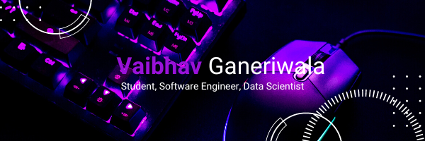

<h3 align="center">
Hi there, I'm <a rel="noreferrer">Vaibhav Ganeriwala</a> 👋
</h3>

<h2 align="center">
I'm a Full-Time Student, Software Engineer, and Data Scientist 💻!
</h2> 

I love the entire process of developing creative softwares. I love the challenge of finding caches and spending time to meet new people. Learning how people hide things and where people are likely to look.

### 🤝 Connect with me:

 
- 💬 If you have any question/feedback, please do not hesitate to reach out to me!

## 🔭 I'm currently working on

- Still In Progress

## 🌱 I'm currently learning

- 📱 Python
- 📱 React

## 💼 Technical Skills

 

 

## 📈 GitHub Stats 

